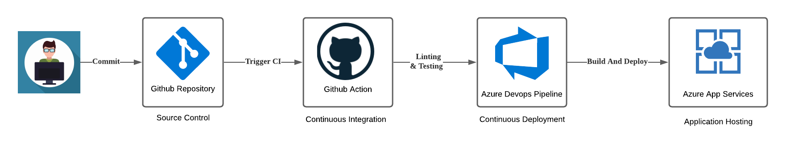

# Overview

This project expose an api to allow user to get the prediction of housing price based on pre-trained model.

The project source code is maintained on github repository and using git action to run linting and testing automatically upon checking into the source code.

For the deployment of the project, it is automated by using azure devops pipeline to deploy directly to azure app service when the code has checked into the main branch.

The project uses - Flask and scikit-learn to provide ML API and there is no frontend UI for the enduser to directly get the prediction.

## Project Plan

<TODO: Project Plan

- A link to a Trello board for the project
- A link to a spreadsheet that includes the original and final project plan>

## Instructions



<TODO: Instructions for running the Python project. How could a user with no context run this project without asking you for any help. Include screenshots with explicit steps to create that work. Be sure to at least include the following screenshots:

- Project running on Azure App Service

- Project cloned into Azure Cloud Shell

- Passing tests that are displayed after running the `make all` command from the `Makefile`

- Output of a test run

- Successful deploy of the project in Azure Pipelines. [Note the official documentation should be referred to and double checked as you setup CI/CD](https://docs.microsoft.com/en-us/azure/devops/pipelines/ecosystems/python-webapp?view=azure-devops).

- Running Azure App Service from Azure Pipelines automatic deployment

- Successful prediction from deployed flask app in Azure Cloud Shell. [Use this file as a template for the deployed prediction](https://github.com/udacity/nd082-Azure-Cloud-DevOps-Starter-Code/blob/master/C2-AgileDevelopmentwithAzure/project/starter_files/flask-sklearn/make_predict_azure_app.sh).
  The output should look similar to this:

```bash
udacity@Azure:~$ ./make_predict_azure_app.sh
Port: 443
{"prediction":[20.35373177134412]}
```

- Output of streamed log files from deployed application

>

## Enhancements

<TODO: A short description of how to improve the project in the future>

## Demo

<TODO: Add link Screencast on YouTube>
