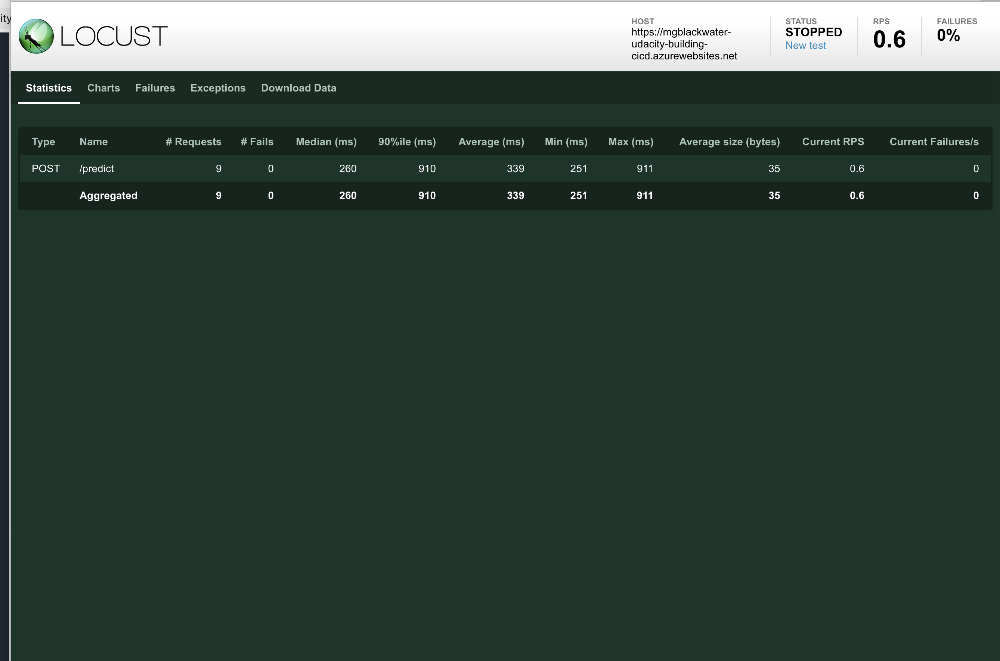

# Overview

This project expose an api to allow user to get the prediction of housing price based on pre-trained model.

The project source code is maintained on github repository and using git action to run linting and testing automatically upon checking into the source code.

For the deployment of the project, it is automated by using azure devops pipeline to deploy directly to azure app service when the code has checked into the main branch.

## Project Plan

[Project Planning can be found on this google spreadsheet](https://docs.google.com/spreadsheets/d/1uivvu4tP8pS4hrBvUzjOVptkkaY-F9Z_h72sHcPnbVA/edit?usp=sharing)

[Build status of the projecte can be tracked here](https://trello.com/b/nYpH9FUr/simple-project-board)

## Instructions


To host the application on azure to try out, please follow below steps -

1. Clone the repository

```
git clone git@github.com:mgblackwater/udacity-building-cicd.git
```


2. Prepare the virtual environment

```
python3 -m venv .venv
source .venv/bin/activate
```

2. Execute make all script to install dependencies, lint and test

```
make all
```


3. Implement CI with Github Action

The details explaination of setting up CI using Github Action can be found here - https://docs.github.com/en/free-pro-team@latest/actions/guides/building-and-testing-python

Once the new workflow is setup, the build will be triggered and it should be successfully build as below.


4. Configure azure devops pipeline to deploy the application to azure app service automatically

[Please refer the official document from Microsoft on how to setup CI/CD on azure devops -](https://docs.microsoft.com/en-us/azure/devops/pipelines/ecosystems/python-webapp?view=azure-devops).


5. [Use this file as a template for the deployed prediction](https://github.com/udacity/nd082-Azure-Cloud-DevOps-Starter-Code/blob/master/C2-AgileDevelopmentwithAzure/project/starter_files/flask-sklearn/make_predict_azure_app.sh).

Replace the app url and execute the bash file -

```bash
./make_predict_azure_app.sh
```


6. Output of streamed log files from deployed application can be view via -

[Azure website](https://mgblackwater-udacity-building-cicd.scm.azurewebsites.net/api/logs/docker) Or Stream Them

```
az webapp log tail
```


7. Load test result



## Enhancements

- The project can be further enhanced as per the project plan to include UI for the end user to directly access via the website as well as the API.

- To integrate with the centralized logging system like elasticsearch to analyze logs to understand usage of the system

## Demo

https://www.youtube.com/watch?v=9Gw0i6AHD-U&feature=youtu.be
